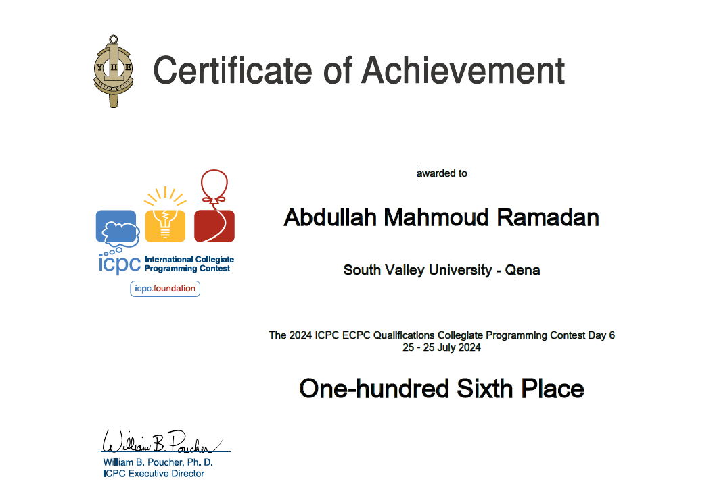
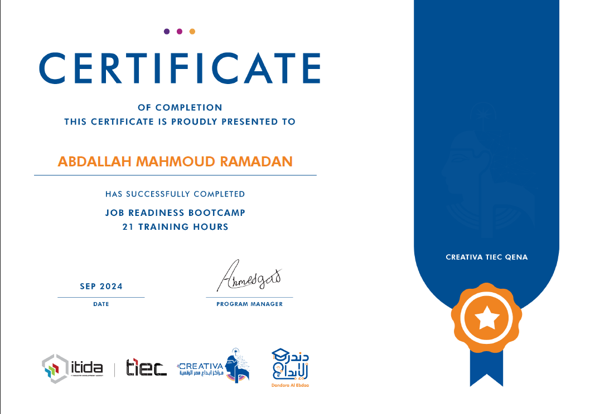
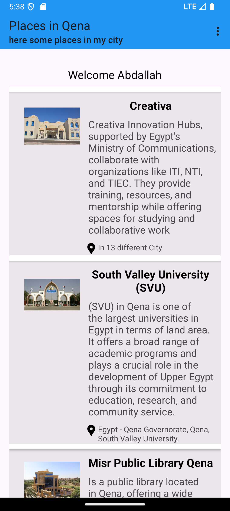

## Android Developer | Software Engineering Student

#### Technical Skills: Kotlin, XML, Jetpack Compose, C++

---

## About
I'm a second-year Computer Science student passionate about mobile app development and technology. 
Currently focusing on Android development with Kotlin, I also mentor at SVU University, helping students improve problem-solving skills. 
I'm enrolled in the Mobile Development track at the Digital Egypt Pioneers Initiative (DEPI), where I expand my expertise in Android development, Kotlin, and Jetpack Compose. 
Alongside academics, I work on personal projects and collaborate on our DEPI graduation project to continually refine my skills

---

## Unique Selling Point (USP)
I possess a unique combination of technical skills in **Software Development** and hands-on experience in **problem-solving mentoring**. I thrive in collaborative environments and am dedicated to continuous learning, making me adaptable to new technologies and challenges. With a strong foundation in **Android Development** and a deep passion for **competitive programming**, I can deliver high-quality solutions while helping others grow their skills.

---

## Education
- **BSc in Computer Science**, South Valley University (2024-2027)
- **Digital Egypt Pioneers (DEPI)**: Android Development Track & Soft Skills

---

## Skills
- **Kotlin**: Developed small Android apps using Kotlin.
- **C++, OOP, and Data Structure**: Created projects implementing core OOP principles and algorithms.
- **Problem Solving**: Solved over 900 problems on [Codeforces](https://codeforces.com/profile/Abdallah_Alqiran) and more than 30 problems on [LeetCode](https://leetcode.com/u/Abdallah_Alqiran).
- **Communication and Teamwork**: Experienced in presenting technical concepts clearly to audiences. Collaborated effectively with teammates in the ECPC qualifications competition.
- **Git and GitHub**: Good at version control and collaborating on GitHub repositories.
- **Fast Typer**: Practiced typing on [MonkeyType](https://monkeytype.com/profile/Abdallah_Alqiran) and [TypeRacer](https://data.typeracer.com/pit/profile?user=abdallah_alqiran).

---

## Certificates

- **ECPC Qualification Round Participation Certificate**  

  

- **Job Readiness Course**  

  

---

## Experience
- **Mentor at SVU** (2024 - Currently): Guiding students who are building their problem-solving skills at the University.
- **Competitive Programming** (07/2024): Participated in the ECPC Qualification round.
- **Presentations** (2024): Delivered multiple presentations to university students on various topics. Assisted in the creation and delivery of three presentations.

---

## Projects
### 1. Places in Qena
This Android application was developed as part of the DEPI initiative. It features a Sign In screen with input validation and a dynamic list of places in Qena. The project follows best practices for RecyclerView implementation for an enhanced user experience.

  

You can check the project on [GitHub here](https://github.com/Abdallah-Alqiran/Places-in-Qena).

---

## Résumé

You can check or download my résumé through the following link:  
[View my résumé on Google Drive](https://drive.google.com/drive/folders/1H3fWSC_sh6Sic_gVzc5DmiTSNDd0pXvx).

---

## Contact Information
- **Email**: [abdallahalqiran765@gmail.com](mailto:abdallahalqiran765@gmail.com)
- **Phone and WhatsApp**: [+20 101 661 1062](tel:+201016611062) 
- **LinkedIn**: [LinkedIn Profile](https://www.linkedin.com/in/abdallah-alqiran/)
- **GitHub**: [GitHub Profile](https://github.com/Abdallah-Alqiran)

---

## Special Thanks
Thank you so much for taking the time to review my portfolio! 😊 I'm constantly working to grow and improve, and I appreciate any feedback you may have. Let's keep pushing forward and striving for excellence! 🚀

Feel free to reach out if you want to discuss ideas, share insights, or collaborate on exciting projects. The journey is just beginning—let's make it count!
