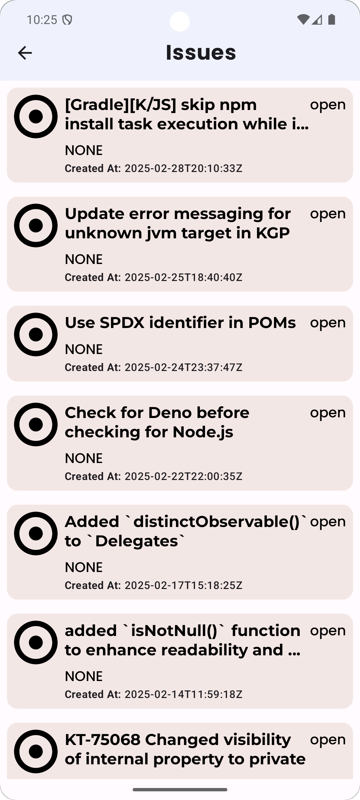

## Android Developer | Software Engineering Student

#### Technical Skills: Kotlin, XML, Jetpack Compose, C++

---

## Unique Selling Point (USP)
I possess a unique combination of technical skills in **Software Development** and hands-on experience in **problem-solving mentoring**. I thrive in collaborative environments and am dedicated to continuous learning, making me adaptable to new technologies and challenges. With a strong foundation in **Android Development** and a deep passion for **competitive programming**, I can deliver high-quality solutions while helping others grow their skills.

---

## About
I'm a **Computer Science student** passionate about mobile app development and technology. 

Currently focusing on **Android development** with Kotlin, I also **mentor at SVU University**, helping students improve problem-solving skills. 
I'm enrolled in the **Mobile Development** track at the Digital Egypt Pioneers Initiative (DEPI), where I expand my expertise in Android development, Kotlin, and Jetpack Compose with knowledge about MVVM, Clean Architecture, Dependency Injection, Design Patterns.

Alongside academics, I work on personal projects and collaborate on our DEPI graduation project to continually refine my skills.

---

## Education
- **BSc in Computer Science**, South Valley University (Qena University) (2024-2027)
- **Digital Egypt Pioneers (DEPI)**: Mobile Development Track & Soft Skills

---
## Experience
- **Mentor at SVU** (2024 - Currently): Guiding students who are building their problem-solving skills at the University.
- **Competitive Programming** (07/2024): Participated in the ECPC Qualification round.
- **Presentations** (2024): Delivered multiple presentations to university students on various topics. Assisted in the creation and delivery of three presentations.

---

## Projects
### 1. GitHub Trend Explorer project
This Android application was developed as part of the DEPI initiative. The project successfully created a platform to display popular GitHub repositories, showcasing essential details such as stars, forks, and topics. Throughout development, best practices for API integration and dynamic content rendering were implemented to ensure an optimized user experience.

**Technologies Used**
- Language: Kotlin
- Tools: Android Studio, Jetpack Compose
- Architecture: Clean Architecture, MVVM
- Libraries & Patterns: Retrofit, Room, Design Patterns
- Data Management: Data Sources, Domain Layer
- Dependency Injection: Dagger Hilt
- Concurrency: Coroutines, Flow
- UI & UX: Material Design, Jetpack Compose Components
- State Management: ViewModel, StateFlow

  
  
  

You can check the project on [GitHub here](https://github.com/Abdallah-Alqiran/GitHub-Trend-Explorer-Project).

## Certificates

- **ECPC Qualification Round Participation Certificate**  

  

- **Job Readiness Course**  

  

---
## Technical Skills:
- Kotlin, Compose, XML.
- OOP and Data Structure.
- Clean Architecture, MVVM, Design Patterns and SOLIDs Principles.
- Problem solving (1000+ problems on [Codeforces](https://codeforces.com/profile/Abdallah_Alqiran) & [LeetCode](https://leetcode.com/u/Abdallah_Alqiran)).
- Retrofit, ROOM, Dagger Hilt.
- Git and GitHub.

## Soft Skills:
- Communication
- Teamwork

---

## Special Thanks
Thank you so much for taking the time to review my portfolio! 😊 I'm constantly working to grow and improve, and I appreciate any feedback you may have. Let's keep pushing forward and striving for excellence! 🚀

Feel free to reach out if you want to discuss ideas, share insights, or collaborate on exciting projects. The journey is just beginning—let's make it count!
---

## Resume

You can check or download my resume through the following link:  
[View my resume on Google Drive](https://drive.google.com/drive/folders/1H3fWSC_sh6Sic_gVzc5DmiTSNDd0pXvx).

---

## Contact Information
- **Email**: [abdallahalqiran765@gmail.com](mailto:abdallahalqiran765@gmail.com)
- **Phone and WhatsApp**: [+20 101 661 1062](tel:+201016611062) 
- **LinkedIn**: [LinkedIn Profile](https://www.linkedin.com/in/abdallah-alqiran/)
- **GitHub**: [GitHub Profile](https://github.com/Abdallah-Alqiran)

---
